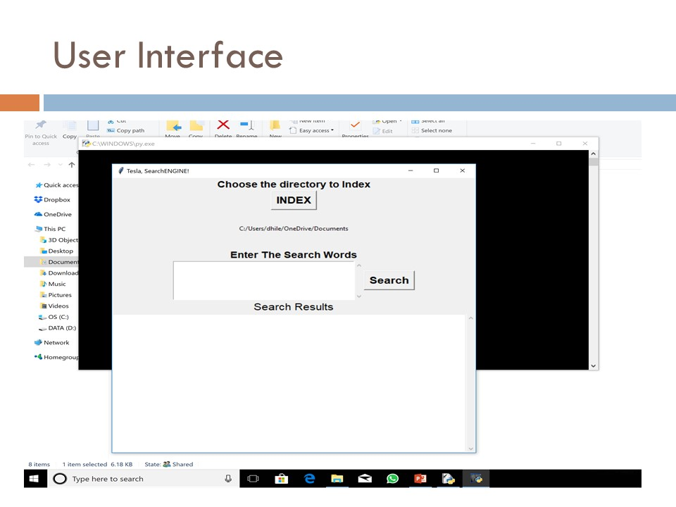
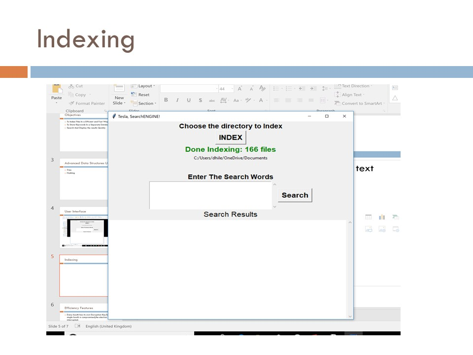
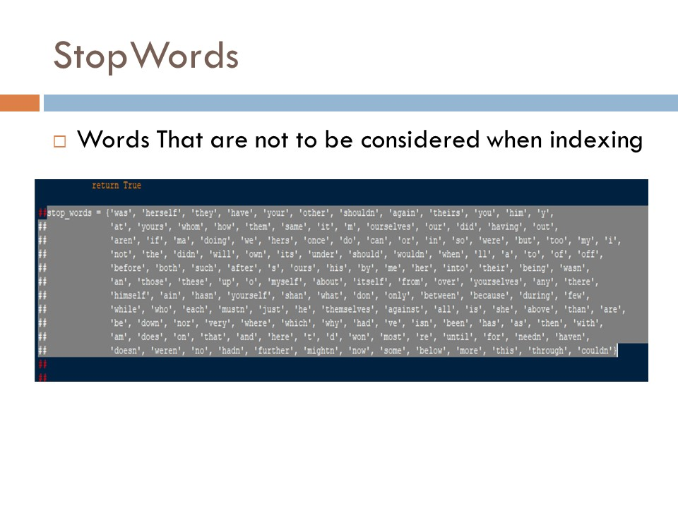
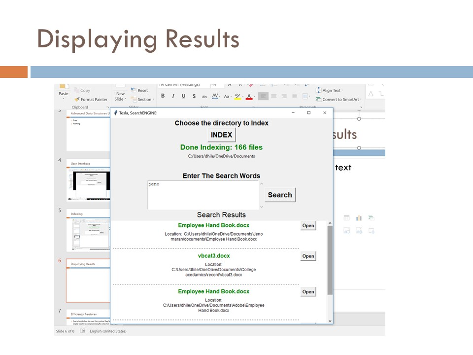

# TESLA_SearchEngine
A Python 3 application which receives the directory to be indexed form the user and indexes all the text-based files and stores them in a tries data structure along with a hash table for reference. Usage of tries helped in achieving better time and space complexity.
Language/Tools: Python

